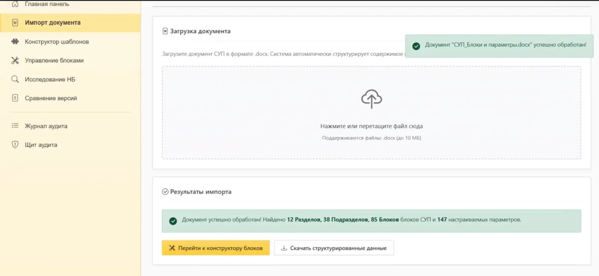
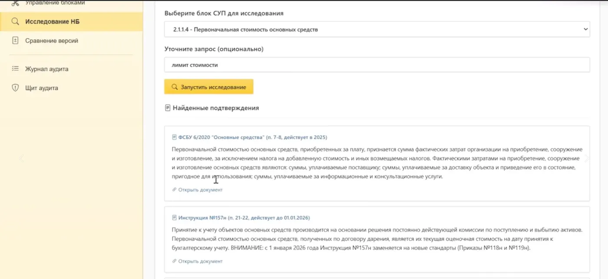
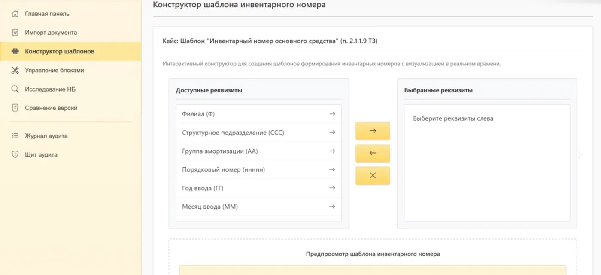
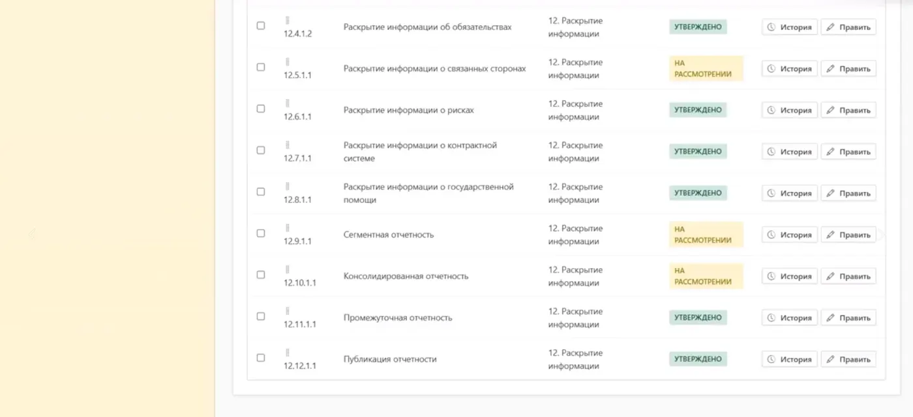
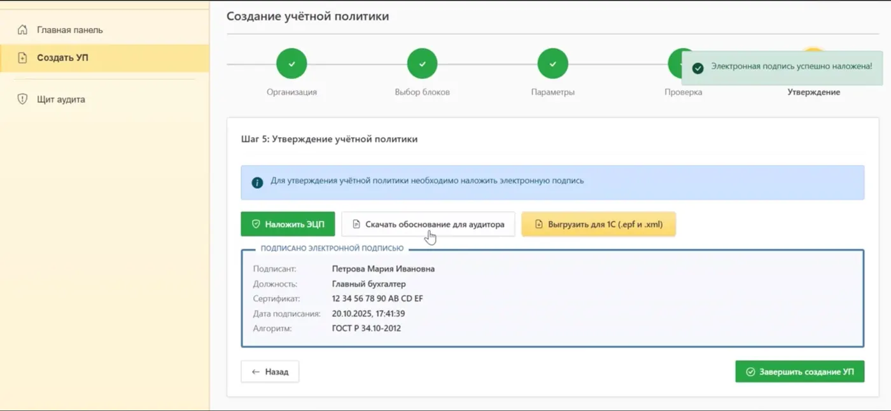

# ESUP Moscow Prototype

Prototype for a Moscow Department of Finance case on digital accounting policy for public-sector organizations.

The starting point was a large standardized accounting policy (СУП) in Word. The system split it into structured blocks, filtered them for a specific organization, helped assemble an organization-level policy, checked completeness and prepared selected rules for further use in 1C workflows.

## Flow

`Word → structured SUP blocks → organization parameters → block selection → completeness check → approval / export → 1C`

## Screens

| Normative research | Inventory-number template |
| --- | --- |
|  |  |
| **Block management** | **Policy approval / 1C export** |
|  |  |

## What was implemented

- parsing Word documents into sections, subsections and blocks
- filtering blocks by organization parameters, accounting type and industry
- YandexGPT recommendations for block applicability
- a step-by-step policy builder
- completeness checks for required and recommended blocks
- block status, version comparison and document generation
- approval/signature flow concepts and preparation of structured settings for 1C

## My contribution

**Tim Ostvald — interface work and improvements to document processing, generation and AI-assisted features.**

This was a team project. Frontend, backend, database and 1C-related work was shared between the participants.

## Team

- **Tim Ostvald**
- **Zakhar Kondratiev**
- **Nikita Musienko**

The project is about a year old, so exact ownership of every individual file is not preserved.

## Code in this repository

- `code-samples/client/Wizard.tsx` — policy assembly flow
- `code-samples/client/BlockSelector.tsx` — block selection and recommendations
- `code-samples/client/CompletenessChecker.tsx` — completeness check
- `code-samples/client/DiffViewer.tsx` — version comparison
- `code-samples/server/wordParser.ts` — Word → structured blocks
- `code-samples/server/wordGenerator.ts` — Word document generation
- `code-samples/server/yandexgpt.ts` — YandexGPT recommendation logic
- `code-samples/shared/schema.ts` — core data model

## Stack

`React` · `TypeScript` · `Node.js` · `Express` · `PostgreSQL` · `Drizzle ORM` · `Mammoth` · `docx` · `YandexGPT`

## Repository note

This repository contains a cleaned subset of the original prototype. Secrets, real organization data, official 1C configuration files and challenge attachments are not included. It is not the production system of the Moscow Department of Finance.

See [`docs/ARCHITECTURE.md`](docs/ARCHITECTURE.md).
